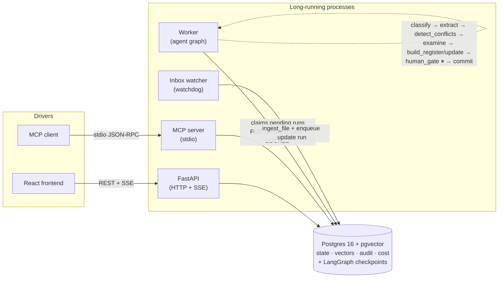
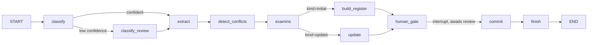

# PM Document Analyst

An agentic system that ingests a pile of PM documents, extracts sourced
claims, detects conflicts, checks a rules playbook, and produces a Feature
Register. Every commit to the register is gated by a human. New documents
trigger incremental updates, not rewrites.

Full design: [`IMPLEMENTATION_PLAN.md`](./IMPLEMENTATION_PLAN.md). Build
order: [`TASK_BREAKDOWN.md`](./TASK_BREAKDOWN.md).

## Scope

**Domain:** software engineering documents for product managers (SWE-for-PM).
The pile a PM lives inside — PRDs, tech specs/RFCs, sprint plans, ticket
exports, meeting notes, release notes, and incident postmortems — is
ingested and reconciled into a single **Feature Register**: one row per
feature/epic, with scope, owner, target release, status, open risks, and a
source-of-truth link for every field.

**Accepted formats**, declared explicitly per the brief:

| Extension | Typical source |
|---|---|
| `.md`   | PRDs, RFCs, release notes |
| `.txt`  | Meeting notes, transcripts |
| `.pdf`  | Tech specs, exported docs |
| `.docx` | PRDs authored in Word |
| `.csv`  | JIRA/Linear ticket exports |
| `.json` | Structured ticket/API exports |

Any file outside this set is rejected with a clear error message at
ingestion time — it is never silently skipped.

## Setup

Run `make dev`. Open http://localhost:5173.

This stands up Postgres via Docker Compose, installs Python and Node
dependencies, runs migrations, seeds and ingests the demo corpora
(`corpus/demo/`, `corpus/demo2/` — see `backend/scripts/seed_demo.py`), and
starts the backend and frontend dev servers. See section 5.3 of
`IMPLEMENTATION_PLAN.md` for the exact steps that command performs.

Other targets: `make test` runs the test suite, `make seed` reseeds the
demo corpora, `make db-up` / `make db-down` start and stop just the
database, and `make reset` tears down Postgres (including its volume) and
clears `.logs/`.

`make dev` only starts the API and frontend. Two more processes complete
the picture, each run separately (in their own terminal, with `.env`
already populated with real `ANTHROPIC_API_KEY`/`VOYAGE_API_KEY` values to
do anything beyond ingestion):

- `uv run python -m backend.app.worker` — claims `pending` runs and drives
  them through the agent graph. Nothing runs without this.
- `uv run python -m backend.app.services.watcher` — watches `corpus/inbox/`
  and turns a new stable file into an `update` run against whichever corpus
  declares that folder as its `inbox_path` (the seeded `demo` corpus does).
- `uv run python -m backend.app.mcp_server` — drives the whole flow over
  MCP (stdio) instead of HTTP; see "Machine drivable" below.

## Assumptions

Every ambiguous call made during the build is logged in full, as it
happened, in [`docs/assumptions.md`](./docs/assumptions.md). Highlights:

- A corpus is a folder with one Feature Register; documents dedupe by
  sha256 within a corpus, not across corpora.
- Classification confidence below 0.5 escalates to a (stubbed, MVP-scope)
  human review path rather than failing the run.
- `register_entries` is never written pre-approval — `build_register`/
  `update` only ever propose a `RegisterDiff`; `commit` (post-human-gate)
  is the only place a row is actually inserted or updated.
- An `update` run's scope is the triggering document plus any other
  document that clears a real `pg_trgm` text-similarity floor against it —
  not an unfiltered top-k, which would defeat "only re-extract the
  triggering document" on the small corpora this MVP ships with.
- The reviewer identity is a free-text `X-Reviewer` header / request-body
  field, not authentication (see Cuts).

## Cuts

Every deliberate scope cut is logged in full, with the reasoning behind
it, in [`docs/cuts.md`](./docs/cuts.md). Highlights:

- **No auth.** Reviewer identity is a plain string, sent by the client.
  Building real auth for an MVP graded on ten other behaviors buys nothing.
- **No per-claim human review in the UI.** The gate reviews conflicts,
  findings, and proposed register changes — not every individual claim.
- **No embedding step is wired into ingestion, the watcher, or the graph
  yet.** Hybrid retrieval's vector side is therefore always empty in this
  build; only the keyword/trigram side ever returns hits. The code path
  exists and is tested in isolation (`services/embeddings.py`,
  `test_embeddings.py`); nothing calls it outside tests.
- **Update-run conflict detection only sees claims from within the
  triggering run**, not the full corpus history — a new claim disagreeing
  with a claim from a *previous* run doesn't surface as a `conflicts` row.
- **No automated frontend tests.** Verified manually against a live
  backend instead; see `docs/cuts.md` for exactly what was checked.

## How to run tests

```
make test
```

Runs `uv run pytest -q`. Every test passes with **no `ANTHROPIC_API_KEY` or
`VOYAGE_API_KEY` set** — `backend/tests/fakes.py`'s `FakeLLM`/`FakeEmbedder`
stand in for the real providers (see `backend/tests/conftest.py`'s
`fake_llm`/`fake_embedder` fixtures). Integration tests (`@pytest.mark
.integration`, the majority of the suite) spin up a real Postgres +
pgvector container once per session via `testcontainers` and skip
individually if Docker/Postgres isn't reachable, rather than failing the
whole run. `test_mcp.py` additionally spawns `python -m
backend.app.mcp_server` as a real subprocess.

`make test` needs Docker running (for the test Postgres container) but
does **not** need `docker compose up` — the container is separate from the
dev database `make dev` starts.

## Architecture

Five long-running pieces share one Postgres instance (state, vectors,
audit log, LangGraph checkpoints — see CLAUDE.md's "one database" rule).
Full detail in [`docs/architecture.md`](./docs/architecture.md).



The agent graph itself (inside the worker):


